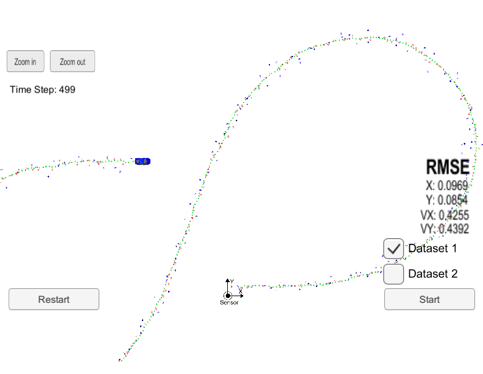
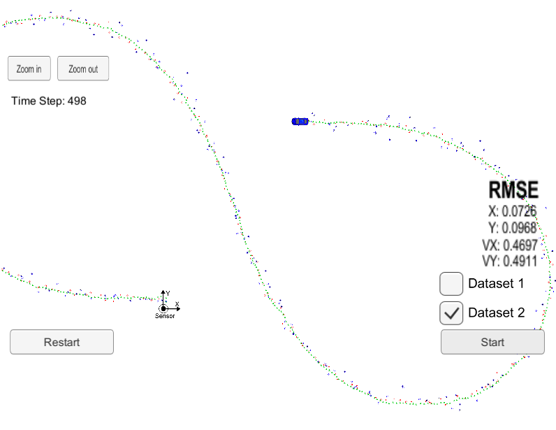
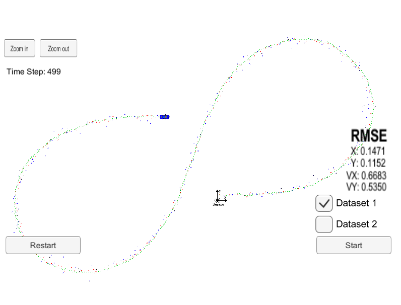
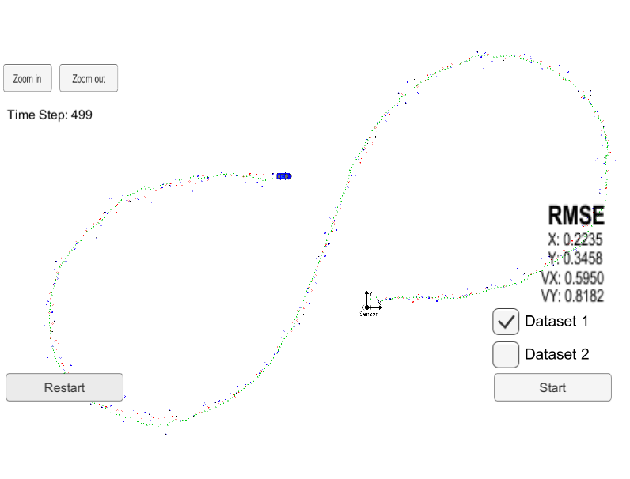

# Extended Kalman Filter in C++

## 1. Introduction

This project utilizes an EKF (Extended Kalman Filter) implemented in C++ to estimate the state of a moving object using noisy LIDAR and RADAR data measurements passed via a simulator. Here's a great resource to get up to speed with the basics of a Kalman Filter.

* [Kalman Filter](http://www.bzarg.com/p/how-a-kalman-filter-works-in-pictures/)

The Extended Kalman filter builds on the Kalman Filter to incorporate non-linearities in the sensor transformation matrixes using a matrix of first order derivatives, known as a Jacobian. Here's a good resource for beginners:

* [Extended Kalman Filter](https://home.wlu.edu/~levys/kalman_tutorial/)

This project was completed as part of Term 2 of Udacity's Self Driving Car Nanodegree program.

## 2. Project Environment
The project was built using the Ubuntu 16-04 bash shell in Windows 10. Instructions to set this up can be found [here](https://www.howtogeek.com/249966/how-to-install-and-use-the-linux-bash-shell-on-windows-10/). The following dependencies need to be in place to build and execute the project.

* [Udacity SDC Term 2 Simulator](https://github.com/udacity/self-driving-car-sim/releases)
* cmake >= 3.5
* make >= 4.1 (Linux, Mac), 3.81 (Windows)
* gcc/g++ >= 5.4
* uWebSocketIO (installed via the [install-ubuntu.sh](https://github.com/shazraz/Extended-Kalman-Filter/blob/master/install-ubuntu.sh) script) 
 
The project consists of the following files located in the [src](https://github.com/shazraz/Extended-Kalman-Filter/tree/master/src) folder:

* [main.cpp](https://github.com/shazraz/Extended-Kalman-Filter/blob/master/src/main.cpp): Interfaces with the simulator using uWebSocketIO to recieve measurements and transmit estimates and RMSE values output by the EKF.
* [FusionEKF.cpp](https://github.com/shazraz/Extended-Kalman-Filter/blob/master/src/FusionEKF.cpp): Instantiates the EKF, initial object state (x), covariance (P) and calls the appropriate Predict() or Update() methods depending on whether LIDAR or RADAR measurements are being processed.
* [kalman_filter.cpp](https://github.com/shazraz/Extended-Kalman-Filter/blob/master/src/kalman_filter.cpp): Implements the Predict(), Update() and UpdateEKF() methods for prediction, LIDAR updates & RADAR updates respectively.
* [tools.cpp](https://github.com/shazraz/Extended-Kalman-Filter/blob/master/src/tools.cpp): Contains tools for calculating the Jacobian and RMSE values.

Once the environment is ready, the code can be tested as follows:

1. Modify initializations for x_ or P_ in FusionEKF.cpp to test other values (Optional)
2. cd build
3. make
4. Launch the simulator and select the EKF/UKF project
5. ./ExtendedKF
6. Click Start in the simulator

The simulator shows a blue vehicle moving in a figure 8 around a stationary sensor. Green markers represent the state estimations determined by the EKF using the noisy RADAR (blue markers) and LIDAR (red markers) data. Two datasets are provided, Dataset 1 has the vehicle initially moving in the positive x direction and Dataset 2 has the vehicle initially moving in the negative x direction.

## 3. Results & Discussion

This EKF models the following characteristics of object state, x: (px, py, vx, vy) where p & v represent the position and velocity respectively. The state is initalized with values x:(```meas1_px```, ```meas1_py```, 0.5, 0.5) where meas1_px and meas1_py are set using the first measurement recieved. The covariance matrix, P, is initialized with a variance of (1,1,500,500) along the diagonals to reflect the uncertainty in the initial velocity but relative certainty in the initial position.

The following images show the results in the simulator for both datasets.

Dataset 1             |  Dataset 2 
:-------------------------:|:-------------------------:
  |    


The images above show accurate estimations of state for the vehicle with the final RMSE values over all timesteps. The effect of individual sensor measurements can be analyzed by turning off the updates for a particular sensor. The images below show the effect of using LIDAR only measurements and RADAR only measurements for Dataset 1.

LIDAR Only           |  RADAR Only
:-------------------------:|:-------------------------:
  |    

It is seen that the overall RMSE value for position in the absence of one sensor is higher than the position RMSE values when both sensors are used. In particular, the RADAR sensor does a poor job of position estimation due to the sensing mechanism used by the sensor i.e. Doppler effect to directly measure velocity. The LIDAR does a relatively better job of estimating position, however, velocity measurements are worse in the absence of RADAR data. 

This demonstrates the value of an EKF which is able to take noisy measurements from multiple sensor types and generate a state estimation more accurate than estimations from individual sensors by combining the Gaussian probability distributions of the measurements with its own prediction (also a Gaussian prob. dist.) of where the tracked object is located.

